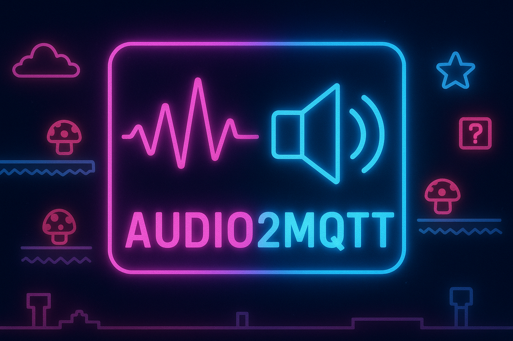

[](https://choosealicense.com/licenses/mit/)


> ⚠️ **Work in Progress**: This project is under active development and not ready for production use. Features may be
> incomplete, APIs may change, and bugs are expected.

# audio2mqtt

**Audio Classification with YAMNet Transfer Learning**

A custom audio classification system built on Google's YAMNet model using transfer learning.

## Concepts

### YAMNet
YAMNet is a pre-trained deep neural network for audio event detection. It:
- Uses MobileNetV1 architecture
- Is trained on AudioSet (521 audio event classes)
- Outputs 1,024-dimensional embeddings per audio frame
- Expects 16kHz mono audio input

### Transfer Learning Approach
Instead of training a full audio classification model from scratch, we:
1. **Use YAMNet as a frozen feature extractor** - Extract high-level audio features (embeddings)
2. **Train a small classifier** - Learn to map embeddings to custom classes
3. **Require minimal training data** - YAMNet already understands audio, we just teach it new categories

This is efficient because:
- YAMNet embeddings capture general audio features (pitch, timbre, rhythm)
- Only the final classification layer needs training
- Works with small datasets (20-50 samples per class)

### Architecture
```
Audio Input (16kHz mono)
    ↓
YAMNet Model (frozen)
    ↓
Embeddings (1024-dim per frame)
    ↓
Custom Classifier
  - Dense(512, relu)
  - Dense(num_classes)
    ↓
Class Predictions
```

## Project Structure

```
audio2mqtt/
├── training/              # Training data organized by class
│   └── mario_dies/       # Class name = folder name
│       ├── death_001.wav
│       ├── death_002.wav
│       └── ...
├── models/               # Saved trained models
│   ├── classifier/       # Trained classifier
│   └── class_names.txt   # Class name mapping
├── audio_util.py         # Audio preprocessing utilities
├── class_map.py          # YAMNet class name loading
├── yamnet_classifier.py  # YAMNet inference functions
├── dataset.py            # Training data loading
├── model.py              # Transfer learning model
├── train.py              # Training script
└── main.py               # Classification script
```

## Training Process

### 1. Prepare Training Data
Organize audio files by class in the `training/` directory:
```
training/
├── mario_dies/
│   ├── sample1.wav
│   ├── sample2.wav
│   └── ...
├── coin_sound/
│   └── ...
└── jump_sound/
    └── ...
```

**Requirements:**
- 16kHz mono WAV files (will be auto-converted if different)
- 20+ samples per class recommended
- Folder name becomes the class label

### 2. Run Training
```bash
python train.py [training_dir] [output_dir]
```

**What happens:**
1. Scans `training/` directory for class folders
2. Loads YAMNet model
3. Extracts embeddings from all training audio (batched)
4. Builds classifier with Dense layers
5. Trains classifier on embeddings for 50 epochs
6. Saves trained model to `models/classifier/`
7. Saves class names to `models/class_names.txt`

**Training output:**
- Model accuracy per epoch
- Final training accuracy
- Saved model location

### 3. Why This Works
- **YAMNet embeddings are time-distributed**: Each ~1 second of audio generates multiple embedding frames
- **Averaging embeddings**: We average across time to get one prediction per file
- **Data augmentation effect**: Multiple frames per file effectively increases training samples
- **No negative samples needed**: Multi-class classification learns to distinguish between your classes

## Classification

### Base YAMNet (521 classes)
Classify using pre-trained YAMNet:
```bash
python main.py audio_file.wav
```

Output shows the AudioSet class with highest confidence.

### Custom Trained Model
Classify using your trained model:
```bash
python main.py audio_file.wav --custom
```

Output shows:
- Predicted custom class
- Confidence score (0-100%)

## Utilities

### Convert Audio Files
Convert directory of WAV files to YAMNet format (16kHz mono):
```bash
python audio_util.py convert input_dir/ output_dir/
```

## Model Details

### Classifier Architecture
```python
Sequential([
    Input(shape=(1024,)),      # YAMNet embedding
    Dense(512, activation='relu'),
    Dense(num_classes)          # Logits output
])
```

### Training Configuration
- **Loss**: SparseCategoricalCrossentropy (multi-class)
- **Optimizer**: Adam (default learning rate)
- **Metrics**: Accuracy
- **Epochs**: 50 (configurable in train.py)
- **Batch size**: 32 embeddings (configurable)

### Inference Pipeline
1. Load audio file → 16kHz mono waveform
2. Pass through YAMNet → Extract embeddings
3. Average embeddings across time → Single 1024-dim vector
4. Pass through classifier → Get logits
5. Softmax → Convert to probabilities
6. Argmax → Get predicted class

## Extending the System

### Add More Classes
1. Create new folder in `training/` with class name
2. Add WAV files to folder
3. Re-run `python train.py`

### Improve Accuracy
- Add more training samples per class
- Ensure audio quality (minimal background noise)
- Use data augmentation (pitch shift, time stretch)
- Adjust classifier architecture in `model.py`
- Increase training epochs in `train.py`

### Export for Production
The trained classifier is a standard Keras model and can be:
- Converted to TensorFlow Lite for mobile/edge deployment
- Served via TensorFlow Serving
- Exported to ONNX for other frameworks

## Technical Notes

### Why Transfer Learning?
Training a full audio model from scratch requires:
- 100,000+ labeled samples
- Days of GPU training time
- Complex data augmentation
- Expertise in audio ML

Transfer learning with YAMNet requires:
- 20+ samples per class
- Minutes of CPU training time
- Minimal preprocessing
- Straightforward implementation

### Limitations
- Works best for sounds similar to AudioSet categories
- May struggle with very domain-specific sounds
- Single-label classification (one class per audio clip)
- Requires entire audio clip (not real-time streaming)

### Performance
- **Inference**: ~100ms per audio file on CPU
- **Training**: ~1-2 minutes for 20 samples on CPU
- **Model size**: ~5MB (classifier only, YAMNet not included)

## License

MIT License - see [LICENSE](LICENSE) file for details.

Copyright (c) 2025 Eirik Sand
